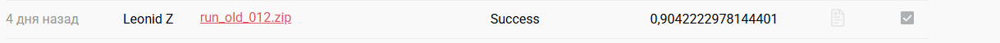

# E-CUP 2026 — Track 2: классификация качества товаров

> **2-е место на Private Leaderboard**  
> Лучший результат: **0.9042222978144401**  
> Финальная система: **Qwen3.5-4B + OLD BAD LoRA + NEW FIRE LoRA + PaddleOCR-VL-1.5**



## Кратко о решении

Задача состояла в бинарной классификации товаров для двух категорий:

- **БАД**;
- **Легковоспламеняющиеся**.

Для обеих категорий используется одна базовая мультимодальная модель **Qwen3.5-4B**, но разные LoRA-адаптеры:

- для `БАД` — **OLD BAD**;
- для `Легковоспламеняющиеся` — **NEW FIRE**.

Дополнительно с изображений извлекается текст при помощи **PaddleOCR-VL-1.5**. OCR не заменяет исходное описание товара, а используется как дополнительный источник информации о составе, маркировке и надписях на упаковке.

Итоговая схема:

```text
                       ┌──────────────────────┐
Название ─────────────►│                      │
Описание ─────────────►│     Qwen3.5-4B      │
                       │                      │
Фото (до 5 шт.) ──────►│  OLD BAD / NEW FIRE │────► logits("0","1")
        │              │       LoRA           │             │
        │              └──────────────────────┘             ▼
        │                                            P(label = 1)
        ▼                                                   │
PaddleOCR-VL-1.5                                            ▼
        │                                       category threshold
        └──────────── OCR text ──────────────────────────────┘
```

## Два финальных сабмита

В репозитории сохранён inference-код **обоих** финальных решений. Отдельные Git-ветки для них не нужны: адаптеры полностью одинаковые, меняется только порог принятия решения для `БАД`.

| Сабмит | BAD adapter | FIRE adapter | BAD threshold | FIRE threshold | Score |
|---|---|---|---:|---:|---:|
| **Hybrid A** | OLD BAD | NEW FIRE | 0.50 | 0.50 | **0.9024064171122994** |
| **Private Best** | OLD BAD | NEW FIRE | **0.12** | 0.50 | **0.9042222978144401** |

Inference-файлы:

```text
runtime/
├── hybrid_a_t050/
│   └── run.py              # BAD=0.50, FIRE=0.50
└── private_best_t012/
    └── run.py              # BAD=0.12, FIRE=0.50
```

Таким образом, **Private Best — это не другая модель**. Это тот же `OLD BAD + NEW FIRE`, но с откалиброванным threshold для BAD.

## Почему финальная система называется OLD BAD + NEW FIRE

На одном из этапов были обучены новые версии адаптеров для обеих категорий. Затем мы провели контролируемую hybrid-ablation:

```text
A = OLD BAD + NEW FIRE
B = NEW BAD + OLD FIRE
```

Результат показал, что обновление FIRE действительно полезно, а замена OLD BAD на NEW BAD ухудшает итоговое качество. Поэтому финальная система намеренно асимметрична:

```text
БАД                    -> OLD BAD
Легковоспламеняющиеся  -> NEW FIRE
```

Слово `OLD` здесь означает не «случайный старый файл», а **лучшую из проверенных версий BAD**, которую мы осознанно сохранили после ablation.

---

# Финальные адаптеры

## 1. OLD BAD

Файлы:

```text
adapters/old_bad/
├── adapter_config.json
└── adapter_model.safetensors
```

SHA256:

```text
adapter_model.safetensors
5a0da02c0bbca13fe0cb7257d85fb407422b705f56d6e449d59acbab1a49984d

adapter_config.json
291d201a9f049f410c80f8744a9ebda57e4f1ecc10e24904c68ddfec1e8fa391
```

### Как был получен

Training notebook:

```text
notebooks/final_adapters/
01_OLD_BAD_ecup2026_phase3_qwen35_qlora.ipynb
```

Это выполненный **Phase 3 Qwen3.5-4B QLoRA** notebook от **12 августа 2026**.

Изначально в notebook был более тяжёлый LoRA-конфиг, но перед реальным training run был применён memory patch для T4:

```text
LoRA r        = 16
LoRA alpha    = 32
LoRA dropout  = 0.05
LR            = 1e-4
epochs        = 1
grad accum    = 8
visual budget ≈ 448×448
contact sheet = 576×576
```

Для BAD использовался фиксированный split:

```text
train = 7123
val   = 346

train labels:
0 -> 1817
1 -> 5306

val labels:
0 -> 88
1 -> 258
```

После обучения notebook сохранил:

```text
qwen35_4b_BAD_qlora/
├── adapter_config.json
├── adapter_model.safetensors
├── target_modules.json
├── training_log.csv
├── training_summary.json
└── val_predictions.csv
```

Позже этот адаптер использовался как Kaggle input `qwen-bad-adapter`. В последующих контролируемых проверках он идентифицировался **не по имени**, а по SHA256:

```text
OLD_BAD_MODEL_SHA256 =
5a0da02c0bbca13fe0cb7257d85fb407422b705f56d6e449d59acbab1a49984d
```

Именно этот бинарный файл находится в финальных Hybrid A и Private Best submission.

> В том же историческом Phase 3 notebook параллельно обучался ранний FIRE-адаптер. Он **не используется** в финальном решении. Из этого notebook для финала берётся только OLD BAD.

---

## 2. NEW FIRE

Файлы:

```text
adapters/new_fire/
├── adapter_config.json
└── adapter_model.safetensors
```

SHA256:

```text
adapter_model.safetensors
6bd02b7950e312d69d3e657b1e7bf61d84c1c07a92ae1a7fdb84c0cb00e55d01

adapter_config.json
278b0025d98a0100ef2f5343c69c01aee5bba7029e28dca9642a36ee2330b45b
```

### Как был получен

Training notebook:

```text
notebooks/final_adapters/
02_NEW_FIRE_qwen35_FSDP_FULLTEXT_2xT4_FINAL.ipynb
```

Это отдельный FIRE-only training pipeline, запущенный **15 августа 2026**.

Конфигурация:

```text
base model       = Qwen/Qwen3.5-4B
training         = FSDP-QLoRA, 2×Tesla T4
LoRA r           = 16
LoRA alpha       = 32
LoRA dropout     = 0.05
LR               = 1e-4
epochs           = 1
global batch     = 8
visual budget    = 448×448
contact sheet    = 576×576
OCR              = full high-quality OCR
text truncation  = none
```

Training set:

```text
unique FIRE rows          = 5502
effective rows after
balanced full coverage    = 10608
```

Notebook:

1. строит contact sheets;
2. подключает HQ OCR;
3. запускает QLoRA через `accelerate` + `FSDP FULL_SHARD` на двух T4;
4. использует last-token classification loss;
5. сохраняет checkpoints каждые 150 optimizer steps;
6. поддерживает automatic resume;
7. экспортирует обычный PEFT adapter после завершения FSDP training.

Финальный FIRE затем сохранялся/использовался как `ecup-qwen35-fire-adapter-backup`, причём при сборке submission принимался только при точном совпадении:

```text
model SHA256
6bd02b7950e312d69d3e657b1e7bf61d84c1c07a92ae1a7fdb84c0cb00e55d01

config SHA256
278b0025d98a0100ef2f5343c69c01aee5bba7029e28dca9642a36ee2330b45b
```

---

# OCR pipeline

На inference используется **PaddleOCR-VL-1.5**.

Для каждого товара:

1. берём до 5 изображений;
2. собираем OCR contact sheet размером `1024×1024`;
3. PaddleOCR-VL извлекает текст с упаковки;
4. OCR text добавляется в prompt Qwen как дополнительная информация;
5. отдельно собирается Qwen contact sheet `576×576`.

Основные runtime-параметры:

```text
MAX_IMAGES                = 5
OCR sheet                 = 1024×1024
Qwen sheet                = 576×576
max description chars     = 2200
max OCR chars             = 2200
```

При ошибке OCR Qwen всё равно может выполнить классификацию по названию, описанию и изображениям.

---

# Как считается класс

Qwen не генерирует длинный текст для принятия решения.

Берутся logits последней позиции для токенов:

```text
"0"
"1"
```

После softmax получаем:

```text
P(label = 1)
```

Для Hybrid A:

```python
pred = int(p1 >= 0.5)
```

Для Private Best:

```python
threshold = 0.12 if category == BAD else 0.5
pred = int(p1 >= threshold)
```

То есть прирост от `0.9024064` до `0.9042223` получен **без замены весов** — только за счёт calibration BAD threshold.

---

# Структура репозитория

```text
.
├── README.md
│
├── adapters/
│   ├── old_bad/
│   │   ├── adapter_config.json
│   │   └── adapter_model.safetensors
│   │
│   └── new_fire/
│       ├── adapter_config.json
│       └── adapter_model.safetensors
│
├── notebooks/
│   └── final_adapters/
│       ├── 01_OLD_BAD_ecup2026_phase3_qwen35_qlora.ipynb
│       ├── 02_NEW_FIRE_qwen35_FSDP_FULLTEXT_2xT4_FINAL.ipynb
│       └── README.md
│
├── runtime/
│   ├── hybrid_a_t050/
│   │   └── run.py
│   ├── private_best_t012/
│   │   └── run.py
│   └── common/
│       └── metadata.json
│
├── scripts/
│   ├── build_submissions.py
│   ├── compare_final_runtimes.py
│   ├── inspect_submission.py
│   └── verify_artifacts.py
│
├── manifests/
│   ├── final_artifacts.json
│   ├── notebook_history.csv
│   └── ...
│
├── docs/
│   ├── FINAL_SUBMISSIONS.md
│   ├── NOTEBOOK_INVENTORY.md
│   └── ...
│
├── assets/
│   └── leaderboard/
│
└── wheels/
    └── peft-0.20.0-py3-none-any.whl
```

В репозитории намеренно находятся **только два training notebook**, необходимые для понимания происхождения двух финальных адаптеров. Остальные эксперименты — OCR ablation, error mining, CLEAN213, TPU/DDP-пробы, NEW BAD, threshold sweeps и submission builders — описаны текстом, но не засоряют финальный репозиторий десятками исследовательских notebooks.

---

# Проверка финальных файлов

Финальные адаптеры в обоих реально отправленных submission ZIP были сверены побайтово.

| Артефакт | SHA256 |
|---|---|
| OLD BAD weights | `5a0da02c0bbca13fe0cb7257d85fb407422b705f56d6e449d59acbab1a49984d` |
| OLD BAD config | `291d201a9f049f410c80f8744a9ebda57e4f1ecc10e24904c68ddfec1e8fa391` |
| NEW FIRE weights | `6bd02b7950e312d69d3e657b1e7bf61d84c1c07a92ae1a7fdb84c0cb00e55d01` |
| NEW FIRE config | `278b0025d98a0100ef2f5343c69c01aee5bba7029e28dca9642a36ee2330b45b` |
| PEFT wheel | `0fbba16ffebfad3de96e06f2da6860fd860292324b85b6141909fa1e26ea9233` |

Для обоих отправленных сабмитов:

```text
BAD weights  -> identical
BAD config   -> identical
FIRE weights -> identical
FIRE config  -> identical
```

Единственное функциональное отличие двух `run.py` — BAD threshold.

---

# Воспроизведение submission

В competition runtime ожидаются модели:

```text
/shared_models/Qwen/Qwen3.5-4B
/shared_models/PaddlePaddle/PaddleOCR-VL-1.5
```

После размещения адаптеров submission можно собрать:

Private Best:

```bash
python scripts/build_submissions.py \
    --profile private_best_t012 \
    --source rebuild
```

Hybrid A:

```bash
python scripts/build_submissions.py \
    --profile hybrid_a_t050 \
    --source rebuild
```

---

# Хронология ключевых решений

| Дата | Этап | Результат |
|---|---|---|
| **12.08.2026** | Phase 3 Qwen3.5-4B QLoRA | получен будущий **OLD BAD** |
| **15.08.2026** | FIRE-only FSDP-QLoRA + full HQ OCR | получен **NEW FIRE** |
| далее | controlled hybrid ablation | выбран **OLD BAD + NEW FIRE** |
| далее | BAD error mining / calibration | обнаружено, что `0.5` для BAD слишком высок |
| финал | BAD=0.12, FIRE=0.50 | **0.9042222978144401**, 2-е место Private LB |

## Финальная идея

Главный результат проекта получился не из-за максимального количества моделей, а за счёт последовательной проверки компонентов:

```text
сильный BAD
    +
улучшенный FIRE
    +
OCR как дополнительный сигнал
    +
точная calibration decision threshold
    =
0.9042222978144401
```
