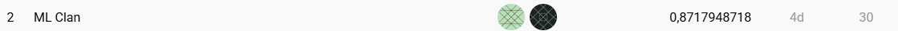
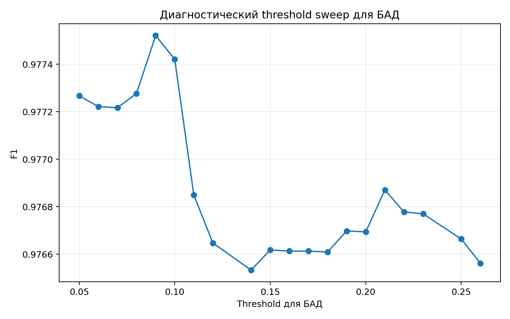
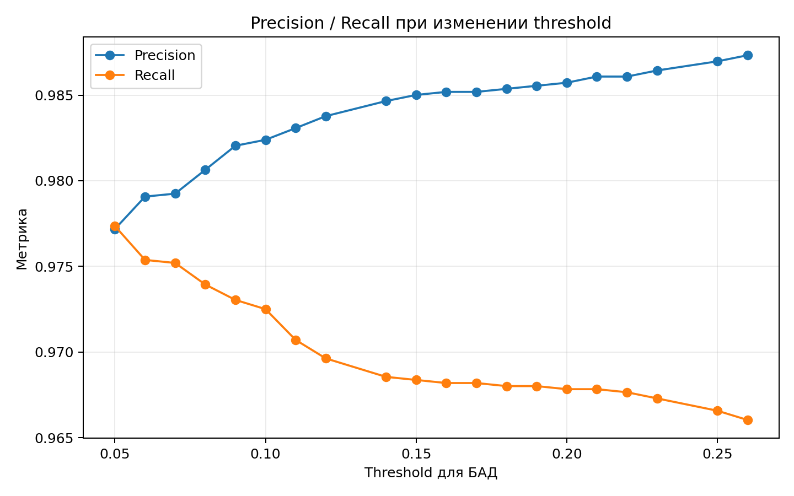

# Ozon E-CUP 2026 - Track 2

## 2-е место на Private Leaderboard

Репозиторий содержит финальное решение задачи классификации товаров по двум категориям:

- БАД
- Легковоспламеняющиеся

Финальный результат на Private Leaderboard:

```text
2-е место
Private score = 0,8717948718
```



## Идея решения

В основе решения используется мультимодальная модель `Qwen/Qwen3.5-4B` и два независимых LoRA-адаптера:

- отдельный адаптер для категории БАД
- отдельный адаптер для категории Легковоспламеняющиеся

Модель использует несколько источников информации о товаре:

- название
- описание
- до 5 изображений
- OCR-текст с изображений

На inference изображения объединяются в contact sheet. Для изображений также выполняется OCR через `PaddlePaddle/PaddleOCR-VL-1.5`. Полученный текст добавляется в prompt Qwen как дополнительный источник информации.

Общая схема:

```text
name + description
        |
        +--------------------------+
        |                          |
        v                          v
   Qwen prompt                product images
                                   |
                         +---------+---------+
                         |                   |
                         v                   v
                  Qwen contact sheet   OCR contact sheet
                                             |
                                             v
                                  PaddleOCR-VL-1.5
                                             |
                                             v
                                          OCR text
                                             |
                         +-------------------+
                         |
                         v
                  Qwen3.5-4B + LoRA
                         |
                         v
                    logits "0"/"1"
                         |
                         v
                    P(label = 1)
                         |
                         v
                category threshold
                         |
                         v
                  final prediction
```

## Гипотезы и исследовательская работа

Финальное решение появилось не из одного training run. Основной цикл разработки выглядел так: фиксировали рабочий baseline, меняли один компонент, отдельно проверяли поведение двух категорий, разбирали ошибки, после чего либо оставляли изменение, либо откатывали его. Для нас было важно не только получить более сильную модель, но и понять, за счет какого именно компонента меняется качество, но в то же время не переобучиться на публичный лидерборд.

### Разные категории требуют разных моделей и разных decision boundary

БАД и Легковоспламеняющиеся оказались сильно разными задачами.

Для БАД большая часть сложных случаев связана с семантикой текста: упоминанием БАД в отрицательном контексте, спортивным питанием, фразами вроде "не является БАД", аналогами и товарами без явной маркировки.

Для Легковоспламеняющихся критичнее визуальные признаки, маркировка на упаковке, состав, предупреждения и наличие опасного компонента в комплекте.

Поэтому вместо общей головы для двух категорий использовались два независимых LoRA-адаптера поверх одного `Qwen/Qwen3.5-4B`. Это позволило отдельно менять обучение, sampling, OCR и threshold каждой категории, не ломая вторую.

### Controlled adapter ablation

На одной из итераций были одновременно получены новые кандидаты для БАД и Легковоспламеняющихся. Совместная замена двух адаптеров ухудшила результат, поэтому мы не стали делать вывод, что вся новая training recipe неудачна.

Вместо этого собрали контролируемые комбинации, в которых менялся только один адаптер. Такой ablation показал, что новый FIRE-адаптер улучшает систему, а новый BAD-адаптер отвечает за регрессию.

В финальном решении поэтому сохранен более устойчивый BAD-адаптер и взят улучшенный OCR-aware FIRE-адаптер. Это был один из самых полезных экспериментов, потому что он позволил локализовать источник изменения качества вместо сравнения двух полностью разных submission.

### OCR как отдельная модальность

Мы отдельно проверяли гипотезу, что текст на фотографиях содержит информацию, которой нет в `name` и `description`.

Для этого был подготовлен zero-training ablation на фиксированном holdout из 600 товаров:

- `BASE` - исходные Qwen + LoRA без OCR-текста в prompt;
- `OCR` - те же веса, те же изображения и тот же prompt, но с дополнительным OCR-текстом;
- веса модели между двумя вариантами не менялись.

Это позволяло измерять именно влияние OCR, а не одновременно влияние нового обучения.

После этого OCR был вынесен в отдельный data pipeline. Весь датасет был обработан OCR, а product-level текст использовался при обучении FIRE-адаптера. На inference OCR также считается непосредственно по изображениям.

При этом OCR никогда не рассматривается как абсолютно надежный источник: в prompt явно указано, что OCR может содержать ошибки. Он используется как дополнительный сигнал вместе с названием, описанием и исходным изображением.

### Полный текст и полный OCR для FIRE

Для Легковоспламеняющихся проверялась гипотеза, что критический признак может находиться далеко от начала описания или только на одной из фотографий.

Поэтому в финальном FIRE training pipeline мы отказались от искусственного ограничения текста:

```text
description truncation = none
OCR truncation         = none
```

FIRE-адаптер обучался на полном описании и полном product-level HQ OCR. Для борьбы с дисбалансом использовалось balanced sampling: из 5502 уникальных товаров было сформировано 10608 эффективных training rows.

В отличие от простого увеличения контекста в runtime, здесь OCR входил непосредственно в training distribution, поэтому модель училась сопоставлять распознанные надписи с целевой меткой.

### Threshold - отдельный параметр модели

Отдельной частью исследования был post-training threshold tuning.

На ранней validation выборке один и тот же набор весов давал:

```text
БАД:
F1 @ 0.50       = 0.938856
best threshold  = 0.85
best F1         = 0.942346
```

Позже full error mining на более широком diagnostic pool показал уже другой режим. Для BAD наблюдалось широкое плато хороших значений в области низких threshold, а максимальный диагностический F1 среди верхних результатов sweep находился около `0.09`.

Например:

| BAD threshold | F1 | Precision | Recall |
|---:|---:|---:|---:|
| 0.05 | 0.977267 | 0.977179 | 0.977354 |
| 0.08 | 0.977277 | 0.980637 | 0.973940 |
| 0.09 | 0.977521 | 0.982042 | 0.973041 |
| 0.10 | 0.977421 | 0.982389 | 0.972502 |
| 0.12 | 0.976647 | 0.983771 | 0.969626 |

Это показало важную вещь: оптимальный threshold сильно зависит от validation slice и не является свойством весов сам по себе. Поэтому мы не зашивали локальный `argmax` из одной validation выборки в модель, а рассматривали threshold как отдельный post-training параметр.

Локальный максимум F1 на diagnostic sweep находился около threshold 0.09, однако область 0.08-0.12 образовывала достаточно плоское плато. Поэтому вместо выбора точного максимума на конкретной выборке мы использовали 0.12 как более консервативную рабочую точку: она немного повышала precision и уменьшала число false positive при практически неизменном F1. Такой выбор также снижал чувствительность финального решения к шуму локальной оценки.

В финальном runtime используется:

```text
БАД                    = 0.12
Легковоспламеняющиеся  = 0.50
```





### Error mining вместо оптимизации только одной цифры

После получения сильного BAD-адаптера мы отдельно анализировали false positive и false negative, а не только aggregate F1.

Ошибки группировались по семантическим паттернам. Среди наиболее характерных:

- наличие слова `БАД`, но в отрицательном или постороннем контексте;
- явное `не является БАД`;
- спортивное питание и жиросжигатели;
- товары без явного BAD-marker;
- противоречие между текстом карточки и надписями на упаковке;
- случаи, где полезный признак присутствует только в OCR.

Например, фраза `не является лекарством, БАД` и фраза `не является лекарственным средством и БАД` визуально похожи, но могут иметь противоположный смысл в зависимости от контекста. Простая keyword-система на таких примерах нестабильна.

Поэтому в prompt появились явные category rules, а OCR остался дополнительным, а не главным источником решения.

### Очистка конфликтующей разметки

Отдельно проверялась гипотеза, что часть ошибок BAD связана не с моделью, а с exact duplicate groups с конфликтующими label.

Была построена очищенная training ветка:

```text
BAD rows:     7469 -> 7256
label 0:      1905 -> 1812
label 1:      5564 -> 5444
removed rows: 213
```

Все 213 удаленных строк были зафиксированы отдельным audit-list, а training pipeline проверял, что ни одна из них не вернулась после OCR join или sampling.

После очистки тот же BAD recipe был дополнительно обучен с полным product-level HQ OCR. Эта ветка была полезна как data-quality experiment, но не дала достаточных оснований заменить BAD-адаптер в финальной системе.

Для нас это важный отрицательный результат: более "чистый" датасет и более богатый input не гарантируют лучшую генерализацию.

### Leakage-resistant validation

Еще одна исследовательская ветка была посвящена надежности локальной оценки.

Для нее был разработан 5-fold `StratifiedGroupKFold`, где одинаковые нормализованные `name + description` принудительно находятся в одном fold. Таким образом почти одинаковые карточки товара не могут одновременно оказаться в train и validation.

Для каждого fold предполагалось независимо обучать Qwen LoRA, получать OOF prediction и затем считать cross-fitted threshold только по другим folds.

Такой протокол нужен не для финального inference, а для ответа на более важный вопрос: действительно ли улучшение переносится на новые группы товаров, или мы видим эффект дубликатов и близких карточек.

### Альтернативный backbone

Мы также подготовили независимую benchmark-ветку на `google/gemma-4-E4B-it`.

Чтобы сравнение было контролируемым:

- был зафиксирован balanced benchmark из 400 товаров;
- по 200 товаров на каждую категорию;
- внутри категории 100 label=0 и 100 label=1;
- все benchmark ID полностью исключались из обучения Gemma;
- objective оставался тем же - бинарное решение через next-token logits `0/1`;
- для двух категорий обучались отдельные LoRA-адаптеры.

Эта ветка не вошла в финальный submission. Ее задача была не заменить Qwen любой ценой, а проверить, насколько наблюдаемые ошибки зависят от конкретного backbone.

### Что в итоге осталось в финальной системе

| Исследовательская гипотеза | Результат |
|---|---|
| Отдельные адаптеры для двух категорий | оставлено |
| Controlled swap адаптеров | позволил сохранить сильный BAD и заменить только FIRE |
| OCR как дополнительная модальность | оставлено |
| OCR-aware training для FIRE | оставлено |
| Полный description + полный OCR для FIRE | оставлено |
| Category-specific threshold | оставлено |
| Error mining и явные category rules | оставлено |
| Удаление 213 конфликтных BAD rows + HQ OCR retraining | проверено, финальный BAD не заменило |
| Group-aware OOF validation | отдельная validation-ветка |
| Gemma 4 E4B | отдельная benchmark-ветка, в финал не вошла |

Главный вывод всей серии экспериментов - наиболее сильный результат дала не максимальная сложность отдельной модели, а контролируемая композиция компонентов: стабильный BAD-адаптер, отдельно улучшенный FIRE-адаптер, multimodal input, OCR как дополнительный источник информации и независимо настроенные decision thresholds.


## Базовая модель

Используется:

```text
Qwen/Qwen3.5-4B
```

В competition runtime модель доступна по пути:

```text
/shared_models/Qwen/Qwen3.5-4B
```

Для каждой категории загружается свой PEFT/LoRA-адаптер:

```text
adapters/
|- bad/
|  |- adapter_config.json
|  \- adapter_model.safetensors
|
\- fire/
   |- adapter_config.json
   \- adapter_model.safetensors
```

## Обучение адаптера для БАД

Training notebook:

```text
notebooks/train_bad_adapter.ipynb
```

В этом ноутбуке обучались адаптеры для БАД и Легковоспламеняющихся товаров, но в итоге адаптер для Легковоспламеняющихся товаров удалось улучшить, в то время как адаптер для БАД остался неизменным.

Адаптер обучался поверх `Qwen/Qwen3.5-4B` через QLoRA.

Основные параметры выполненного training run:

```text
LoRA r         = 16
LoRA alpha     = 32
LoRA dropout   = 0.05
learning rate  = 1e-4
epochs         = 1
contact sheet  = 576x576
```

Обучение сформулировано как бинарная классификация. Модель обучается выбирать целевой токен `"0"` или `"1"` вместо генерации длинного текстового ответа.

Финальные веса:

```text
adapters/bad/adapter_model.safetensors
SHA256:
5a0da02c0bbca13fe0cb7257d85fb407422b705f56d6e449d59acbab1a49984d
```

Config:

```text
adapters/bad/adapter_config.json
SHA256:
291d201a9f049f410c80f8744a9ebda57e4f1ecc10e24904c68ddfec1e8fa391
```

## Обучение адаптера для Легковоспламеняющиеся

Training notebook:

```text
notebooks/train_fire_adapter.ipynb
```

Для этой категории использовался отдельный OCR-aware training pipeline с `Qwen/Qwen3.5-4B`, QLoRA и FSDP на двух NVIDIA T4.

Основные параметры:

```text
base model           = Qwen/Qwen3.5-4B
training             = FSDP + QLoRA
GPU                  = 2 x NVIDIA T4
LoRA r               = 16
LoRA alpha           = 32
LoRA dropout         = 0.05
learning rate        = 1e-4
epochs               = 1
visual side          = 448
contact sheet        = 576x576
unique training rows = 5502
balanced rows        = 10608
text truncation      = none
OCR truncation       = none
```

В training input входят:

- название
- полное описание
- изображения
- заранее рассчитанный OCR-текст

Training pipeline поддерживает checkpointing и resume. После завершения FSDP training адаптер экспортируется в стандартный PEFT-формат.

Финальные веса:

```text
adapters/fire/adapter_model.safetensors
SHA256:
6bd02b7950e312d69d3e657b1e7bf61d84c1c07a92ae1a7fdb84c0cb00e55d01
```

Config:

```text
adapters/fire/adapter_config.json
SHA256:
278b0025d98a0100ef2f5343c69c01aee5bba7029e28dca9642a36ee2330b45b
```

## OCR всего датасета

Для обучения OCR-aware модели OCR был заранее рассчитан для всего датасета.

Финальный OCR-кэш был получен последовательной обработкой изображений двумя OCR backend'ами.

### 1. PaddleOCR-VL-1.5

Первая часть изображений обрабатывалась моделью:

```text
PaddlePaddle/PaddleOCR-VL-1.5
```

OCR запускался параллельно на двух NVIDIA T4. Результаты сохранялись на уровне отдельных изображений в промежуточные CSV, чтобы обработку можно было продолжать после остановки сессии.

### 2. PP-OCRv5 Mobile

Оставшиеся необработанные изображения были дораспознаны через более быстрый PaddleOCR backend:

```text
detector:
PP-OCRv5_mobile_det

recognizer:
eslav_PP-OCRv5_mobile_rec
```

`eslav_PP-OCRv5_mobile_rec` использовался для распознавания русского и английского текста.

Второй OCR pipeline не начинал обработку заново. Он загружал уже готовые результаты PaddleOCR-VL, пропускал ранее обработанные пары `(product_id, image_idx)` и распознавал только недостающие изображения.

Таким образом, весь датасет был OCR-обработан комбинацией двух backend'ов:

```text
PaddlePaddle/PaddleOCR-VL-1.5
+
PP-OCRv5_mobile_det + eslav_PP-OCRv5_mobile_rec
```

После объединения результатов были сформированы два итоговых файла.

### OCR на уровне изображений

```text
data/ocr/ocr_all_images_high_quality.csv
```

Содержит OCR для отдельных фотографий товара.

Этот файл нужен, если требуется работать с OCR каждого изображения отдельно.

### OCR на уровне товаров

```text
data/ocr/ocr_all_products_high_quality.csv
```

Содержит агрегированный OCR на уровне товара. Текст нескольких фотографий одного товара объединён в одно поле `ocr_text`.

Именно product-level OCR использовался как готовый текстовый признак в OCR-aware training pipeline.

Оба CSV хранятся в Git LFS.

Важно различать precomputed OCR для обучения и OCR на финальном inference:

- для подготовки training data использовался объединённый OCR-кэш от двух backend'ов
- в финальном competition inference OCR считается непосредственно через `PaddlePaddle/PaddleOCR-VL-1.5`

## OCR на inference

Финальный runtime использует:

```text
/shared_models/PaddlePaddle/PaddleOCR-VL-1.5
```

Для каждого товара берётся до 5 изображений.

Основные параметры:

```text
MAX_IMAGES            = 5
OCR contact sheet     = 1024x1024
Qwen contact sheet    = 576x576
MAX_DESCRIPTION_CHARS = 2200
MAX_OCR_CHARS         = 2200
OCR_MAX_NEW_TOKENS    = 160
OCR_BATCH_SIZE        = 32
QWEN_BATCH_SIZE       = 24
```

OCR используется как дополнительный сигнал. Он особенно полезен для текста на упаковке:

- состав
- предупреждения
- маркировка
- свойства товара
- названия веществ
- информация, отсутствующая в текстовом описании карточки

Runtime сделан fault-tolerant. Если OCR не удалось получить, классификация продолжается по доступным тексту и изображениям.

## Получение вероятности класса

Для принятия решения не используется свободная autoregressive generation.

Из последней позиции Qwen берутся logits токенов:

```text
"0"
"1"
```

После softmax вычисляется:

```text
P(label = 1)
```

Для финального варианта:

```python
threshold = 0.12 if category == BAD else 0.5
pred = int(p1 >= threshold)
```

## Структура репозитория

```text
.
|- README.md
|- run.py
|- metadata.json
|- manifest.json
|
|- adapters/
|  |- bad/
|  |  |- adapter_config.json
|  |  \- adapter_model.safetensors
|  |
|  \- fire/
|     |- adapter_config.json
|     \- adapter_model.safetensors
|
|- data/
|  \- ocr/
|     |- ocr_all_images_high_quality.csv
|     \- ocr_all_products_high_quality.csv
|
|- notebooks/
|  |- train_bad_adapter.ipynb
|  \- train_fire_adapter.ipynb
|
|- runtime/
|  \- bad_t012_fire_t050/
|     \- run.py
|
|- scripts/
|  |- verify_repo.py
|  \- build_submission.py
|
|- docs/
|  |- ARTIFACTS.md
|  \- REPRODUCIBILITY.md
|
|- assets/
|  \- private_lb.png
|
\- wheels/
   \- peft-0.20.0-py3-none-any.whl
```

## Проверка артефактов

Финальные адаптеры и runtime были сверены по SHA256.

| Артефакт | SHA256 |
|---|---|
| BAD adapter weights | `5a0da02c0bbca13fe0cb7257d85fb407422b705f56d6e449d59acbab1a49984d` |
| BAD adapter config | `291d201a9f049f410c80f8744a9ebda57e4f1ecc10e24904c68ddfec1e8fa391` |
| FIRE adapter weights | `6bd02b7950e312d69d3e657b1e7bf61d84c1c07a92ae1a7fdb84c0cb00e55d01` |
| FIRE adapter config | `278b0025d98a0100ef2f5343c69c01aee5bba7029e28dca9642a36ee2330b45b` |
| Runtime BAD=0.12, FIRE=0.50 | `a0d89f62d57dedd2cb4e9eaf0eeea606c6b7c58e02336fb9f466d89e7a7b83a5` |
| metadata.json | `2e84e4db7be7e3f5d6b7b1fae53b0395eb1a6b913704db6dc4f0b39c51095812` |
| PEFT wheel | `0fbba16ffebfad3de96e06f2da6860fd860292324b85b6141909fa1e26ea9233` |

Проверить локальный репозиторий:

```bash
python scripts/verify_repo.py
```

Успешный результат:

```text
RESULT: ALL OK
```

## Сборка submission

Основной вариант:

```bash
python scripts/build_submission.py --variant bad_t012_fire_t050
```

Готовые архивы создаются в:

```text
submission_out/
```

Competition entry point:

```text
python -u run.py
```

Competition image:

```text
odsai/ecup26-quality-baseline:1.0
```

## Результат

Итог соревнования:

```text
Private Leaderboard = 2-е место
Private score = 0,8717948718
```
